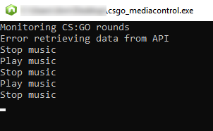

# Counter-Strike: Global Offensive Media Control
Ever complained because you couldn't hear steps but also wanted to enjoy your favorite music? Not a problem anymore.
It controls your media keys depending on your status in game. Plays when you're dead and stops again as soon as you're alive. Works with Spotify and every other Software that can be controlled via Media Keys.

## Installation

- Download the [Release.zip](https://github.com/jkoenen2/csgo_mediacontrol/releases/latest/download/csgo_mediacontrol.zip) and extract it into a new folder
- Move the cfg-file to the cfg folder of your CS:GO installation (e.g. `C:\Program Files (x86)\Steam\steamapps\common\Counter-Strike Global Offensive\csgo\cfg`)
- Stop CS:GO if it was already running
- Start the csgo_mediacontrol.exe and Counter Strike
- enjoy
## Known Bugs
- Sometimes makes you throw away your pistol after respawn
## Built With
- [Node.js](https://nodejs.org/en/)
- [RobotJs](https://robotjs.io/)
- [nexe](https://github.com/nexe/nexe)

## Acknowledgments
- [glenndehaan/csgo-gamestate-spotify](https://github.com/glenndehaan/csgo-gamestate-spotify) - for portions of the code and inspiration because the spotify web helper doesn't work anymore
- [tsuriga/csgo-gsi-qsguide](https://github.com/tsuriga/csgo-gsi-qsguide) - for the cfg-file and basic functionality
